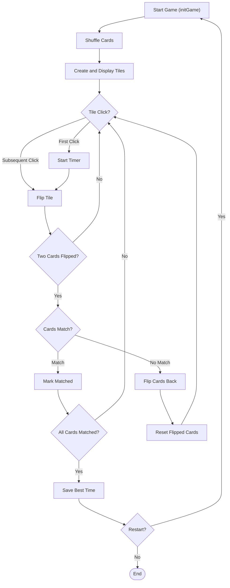
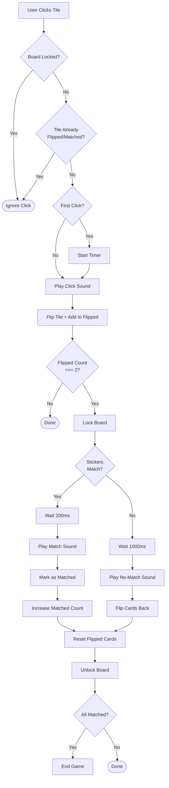

# Paimon's Pair Quest - Memory Matching Game

## 🎮 Project Overview
This is a beautifully designed memory card matching game featuring Paimon from Genshin Impact! The goal is simple: find all matching pairs as quickly as possible. The game keeps track of your best time using localStorage, plays immersive sound effects, and has a smooth UI with flipping card animations.

## ✨ Features
- **4x4 Grid**: 8 unique pairs of Genshin Impact stickers
- **Precision Timer**: Tracks time down to 10ms increments
- **Best Time Persistence**: Saves your best time using localStorage
- **Audio Controls**: Toggle background music, with sound effects for every interaction
- **Restart Functionality**: Reset the game at any time
- **Responsive Design**: Works seamlessly on desktop and mobile devices
- **Smooth Animations**: Beautiful card flip transitions using CSS 3D transforms

## 🎯 Learning Goals
- **DOM Manipulation**: Dynamic creation and manipulation of game elements
- **Event-Driven Programming**: Handling user clicks and game events
- **Timing Functions**: Using `setInterval` for the game timer
- **Local Storage**: Persisting best time across browser sessions
- **CSS Animations**: 3D card flips with `transform-style: preserve-3d`
- **Game State Management**: Tracking flipped cards, matched pairs, and game locks
- **Audio Integration**: Working with the HTML5 Audio API

## 📁 Folder Structure Explained
```
Paimon's Pair Quest/
├── index.html              # Main HTML structure
├── style.css               # All styling and animations
├── script.js               # Game logic and state management
├── assets/
│   ├── icons/              # 8 sticker images (each duplicated for pairs)
│   ├── image/              # Background, logo, and card back images
│   └── sounds/             # Audio files (music and sound effects)
└── .vscode/
    └── settings.json
```

## 🏗️ DOM Structure Breakdown
```html
&lt;body&gt;
  &lt;nav&gt;                      # Navigation bar
    &lt;div.nav-left&gt;          # Logo section
    &lt;div.nav-right&gt;         # Timers (best time + current time)
  &lt;/nav&gt;
  &lt;main&gt;
    &lt;div.tiles-container&gt;   # 4x4 grid - cards injected here via JS
  &lt;/main&gt;
  &lt;footer&gt;                  # Music + Restart buttons
&lt;/body&gt;
```

## 🧠 JavaScript Logic Flow

### Overall Game Workflow


### Card Click & Match Checking Flow


### Game State Variables
| Variable | Purpose |
|----------|---------|
| `cards` | (Unused - leftover from earlier draft) |
| `flippedCards` | Array holding 0-2 currently flipped cards |
| `matchedCount` | Counter for matched pairs (max 16) |
| `isLocked` | Prevents clicking more than 2 cards at once |
| `isMusicPlaying` | Tracks music toggle state |
| `startTime` | Timestamp when game starts |
| `timerInterval` | Reference for the timer interval |
| `bestTime` | Best time retrieved from localStorage |

### Core Functions

#### `initGame()` - Game Initialization
1. Clears previous game state
2. Resets UI elements
3. Creates sticker pairs (8 stickers × 2)
4. Shuffles the array using `Math.random() - 0.5`
5. Creates tile elements dynamically and appends to DOM
6. Attaches click listeners to each tile

#### `onTileClick()` - Tile Click Handler
1. Checks if board is locked → ignores click if true
2. Prevents clicking already flipped/matched cards
3. Starts timer on first click
4. Plays click sound
5. Flips card (adds `.flipped` class)
6. Adds to `flippedCards` array
7. Calls `checkForMatch()` when 2 cards are flipped

#### `checkForMatch()` - Pair Detection
1. Locks board (`isLocked = true`)
2. Compares `dataset.sticker` values of both cards
3. **If match**:
   - Waits 200ms for visual feedback
   - Plays match sound
   - Adds `.matched` class to both
   - Increments `matchedCount`
   - Unlocks board
   - Checks if game is complete
4. **If no match**:
   - Waits 1000ms for user to see both cards
   - Plays mismatch sound
   - Flips cards back
   - Clears `flippedCards`
   - Unlocks board

#### `startTimer()` & `updateTimerDisplay()` - Timer Logic
- Uses `setInterval` that runs every 10ms
- Calculates elapsed time using `Date.now()`
- Formats time as `MM:SS.ms` with `padStart(2, '0')` for leading zeros
- Separates timer display into seconds and milliseconds elements

#### `endGame()` - Game Completion
1. Stops timer interval
2. Calculates final time
3. Compares with best time from localStorage
4. Updates best time if new record is set
5. Saves to localStorage with key `matchIqBestTime`

## 🎨 CSS Techniques Used

### 3D Card Flip Animation
```css
.tile {
  perspective: 1000px; /* Creates 3D space for child elements */
}
.tile-inner {
  transform-style: preserve-3d; /* Preserves 3D transformations */
  transition: transform 0.5s;
}
.tile-front, .tile-back {
  backface-visibility: hidden; /* Hides back face during rotation */
}
.tile-back {
  transform: rotateY(180deg); /* Initially flipped */
}
```
**Mental Model**: Imagine the card exists in 3D space. We flip it 180° on the Y-axis, and hide whichever side is facing away.

### Responsive Layout Strategy
- **Desktop**: Left-aligned game board with margins
- **Tablet (<768px)**: Centered board, smaller cards
- **Mobile (<400px)**: Even smaller cards for compact screens
- Uses CSS Grid for card layout (`grid-template-columns: repeat(4, 100px)`)

### UI Styling
- Glassmorphism navbar: `backdrop-filter: blur(10px)` + semi-transparent background
- Button hover effects: background + scale transitions
- Color coding: Best time is orange, current time is white

## 🔧 Browser APIs Used
1. **localStorage**: Persisting best time
2. **Audio API**: Playing background music and sound effects
3. **DOM API**: Creating/modifying elements
4. **Date API**: Timer calculations
5. **setInterval**: Timer updates

## ⏱️ Timing & Event Loop Concepts
- **setInterval(..., 10)**: Timer updates every 10ms - this is faster than human perception and creates smooth millisecond display
- **setTimeout delays**:
  - 200ms for match feedback (quick)
  - 1000ms for mismatch (gives user time to see both cards)
- **isLocked flag**: Critical for preventing race conditions where user clicks faster than the game can process

## 📊 State Management Approach
Simple but effective state management using plain JS variables:
- **Game state**: `matchedCount`, `isLocked`, `startTime`
- **UI state**: `flippedCards` array, DOM classes
- **Persistent state**: `bestTime` in localStorage
- **Audio state**: `isMusicPlaying`

## 🔍 Key Breakthrough Moments

### Sticker Identification
Sticker filenames are stored directly in `dataset.sticker` for simple comparison:
```javascript
tile.dataset.sticker = sticker;
```
This is straightforward and works perfectly for our sticker filenames!

### Timer Precision
Using `Date.now()` instead of relying on interval accuracy is a smart choice - `setInterval` can drift, but comparing actual timestamps gives precise elapsed time.

## 🐛 Bugs & Debugging Journey (Inferred)
1. **Audio Playback Errors**: The code includes `.catch(e => console.log(e))` everywhere audio plays - likely a fix for browser autoplay policies
2. **Double-click Prevention**: The `isLocked` flag prevents users from flipping more than 2 cards at once
3. **Re-clicking Flipped Cards**: The check `if (tile.classList.contains('flipped') || tile.classList.contains('matched')) return;` stops invalid clicks

## 🚀 Future Improvements
- Add difficulty levels (6x6, 8x8 grids)
- Implement move counter
- Add win animation
- Pause/Resume functionality
- Leaderboard system
- Multiple theme options
- Confetti effect on win

## 💡 Personal Notes
This is an excellent example of a complete, polished frontend project! It balances visual appeal with solid game logic. The attention to detail (sound effects, best time persistence, responsive design) makes it feel like a production-ready game.

## 📚 Resources & References
- [CSS 3D Transforms](https://developer.mozilla.org/en-US/docs/Web/CSS/CSS_3D_Transforms_Using_CSS_3D_Transforms)
- [localStorage API](https://developer.mozilla.org/en-US/docs/Web/API/Window/localStorage)
- [HTML5 Audio](https://developer.mozilla.org/en-US/docs/Web/HTML/Element/audio)
- [Grid Layout](https://developer.mozilla.org/en-US/docs/Web/CSS/CSS_Grid_Layout)
